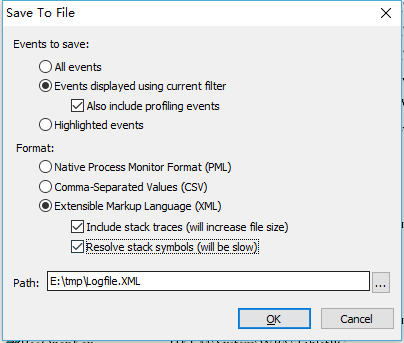

# ProcessMonitor 日志解析. 具体功能参见 [examples.py](examples.py)

0. ProcessMonitor 导出 xml 方法:

1. ProcessMonitor 导出的 xml 文件比较大, 解析事件长, 所以需要解析为 EventContainer() 对象, 保存为 json 文件. 之后从 json 文件创建 EventContainer() 对象进行操作.

2. 示例参见 [examples.py](examples.py)
